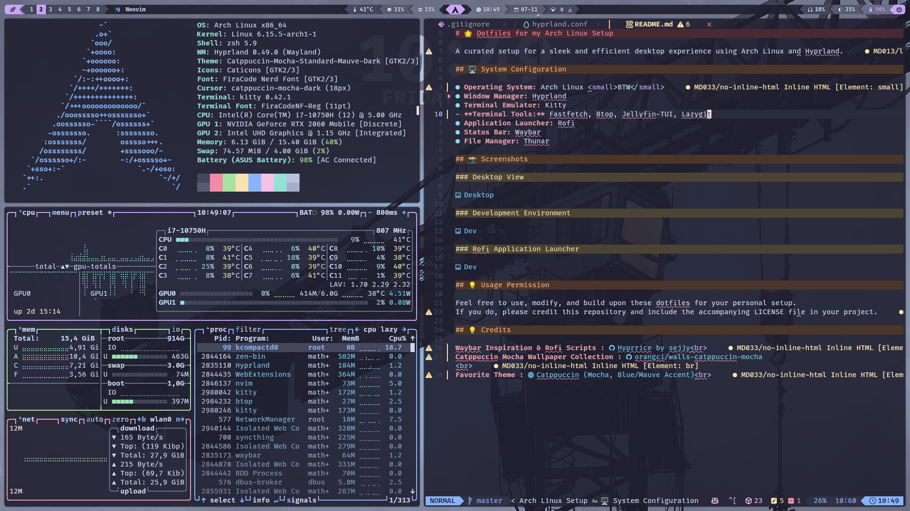

# 🌟 Dotfiles for my Arch Linux Setup

A curated setup for a sleek and efficient desktop experience using Arch Linux and Hyprland.

## 🖥️ System Configuration

- **Operating System:** Arch Linux
- **Window Manager:** Hyprland
- **Wallpaper Manager:** Hyprpaper
- **Terminal Emulator:** Kitty
- **Terminal Tools:** Neofetch, Btop
- **Application Launcher:** Rofi
- **Status Bar:** Waybar
- **File Manager:** Thunar

## 📸 Screenshots

### Desktop View

### Development Environment

### Rofi Application Launcher

## 💡 Usage Permission

Feel free to use, modify, and build upon these dotfiles for your personal setup.
If you do, please credit this repository and include the accompanying LICENSE file in your project.

## 💡 Credits

**Waybar Inspiration & Rofi Scripts :** [Hyprrice by sejjy](https://github.com/sejjy/hyprrice)
**Catppuccin Mocha Wallpaper Collection :** [orangci/walls-catppuccin-mocha](https://github.com/orangci/walls-catppuccin-mocha)
**Favorite Theme :** [Catppuccin (Mocha, Blue/Mauve Accent)](https://catppuccin.com)
